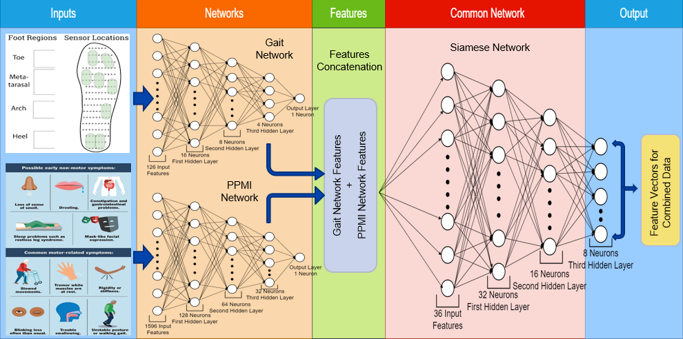
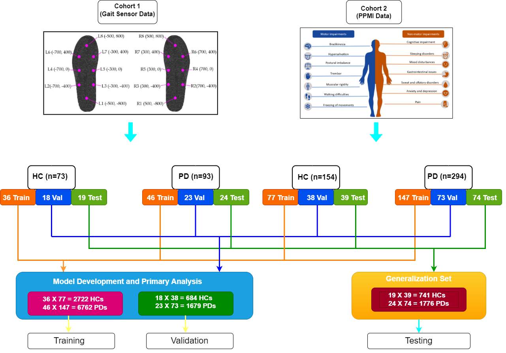
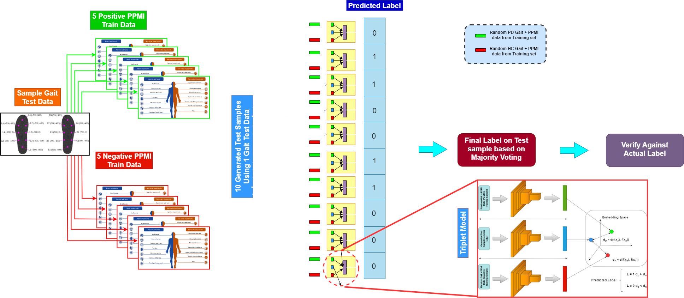

<!-- <h1>Predictive_Analysis_of_Parkinsons_Disease_from_Gait_Sensor_Data_and_Brain_MRI_Images: Predictive Analysis of Parkinsons Disease from Gait Sensor Data and Brain MRI Images</h1> -->
<h2><a href="MTP Report.pdf">Predictive Analysis of Parkinsons Disease from Gait Sensor Data and Brain MRI Images</a></h2>
    
[Arunava Chaudhuri](https://github.com/arunava5764),        [Dr. Deepti R. Bathula](https://www.iitrpr.ac.in/deepti-r-bathula)
    
[Indian Institute of Technology, Ropar](https://www.iitrpr.ac.in/)

This experiment is an extension to the experiment on achieving higher accuracy and lower error using newly developed feature level fusion technique used aggressively in Computer Vision. We have tried to add more functionality to use features coming from different subjects. The unavailability of MRI, SPECT, f-MRI, CT images of patients in many occasions make the situation harder for a doctor to detect Parkinson’s disease based on only clinical diagnosis. Our experiment shows that even if patient have only Gait data or only PPMI data, we can still detect if he/she has the disease or not. This will eventually help us to implement this facility in situations where some doctor has to diagnosis a patients based on several modality’s data. We have successfully evaluated the possibility of achieving better accuracy using feature level fusion of several modalities where data comes from different subjects. The attempt to combine the features of different domain comes out to be an unique combination to find pattern in Parkinson’s disease patient data. While the aim is for accurate prediction in medical domain it has also eliminate the need for having all kinds of information required for classifying a particular disease of a patient.

  
Table of Contents

  <ol>
    <li><a href="#File-Description">File Description</a></li>
    <li><a href="#Datasets">Datasets</a></li>
    <li><a href="#Steps-to-Replicate-the-Experiment">Steps to Replicate the Experiment</a></li>
    <li><a href="#Traning-and-Validation">Trainng and Validation</a></li>
    <li><a href="#Test-Flow">Test Flow</a></li>
    <li><a href="#Comparison-Between-Multi-Modality-and-Baseline-Single-Modality">Comparison Between Multi-Modality and Baseline Single Modality</a></li>
    <li><a href="#Comaprison-With-Previous-PPMI-Experiment">Comaprison With Previous PPMI Experiment</a></li>
    <li><a href="#Comaprison-With-Previous-Gait-Experiment">Comaprison With Previous Gait Experimen</a></li>
    <li><a href="#acknowledgement">Acknowledgement</a></li>
  </ol>

## File Description

The content of each folder of this repository is described as follows.
- [x] **Baseline_Model_Code** This folder contains code files for creating baseline Gait model and PPMI model.
- [x] **Baseline_Model_Data** 
    - [x] **Preprossed_Gait_Data** This folder contains data files for baseline Gait model where the data has been proprocessed using statistical methods and devided based on class and each class file is denoted as `Gait_HC.csv` and `Gait_PD.csv` data fils.
    - [x] **Preprocessed_PPMI_Data** This folder contains data files for baseline PPMI model where the data has been collected based on some criteria and devided based on class and each class file is denoted as `PPMI_HC.csv` and `PPMI_PD.csv` data fils.
- [x] **Data_Preprocessing_Code** This folder contains three code files. `Data_Division` code file separates preprocessed data based on class and generates new lass wise datasets. `Gait_Data_Preprocessing` code file takes the original Gait source file and converts it to more readble format to suit our experiment. `PPMI_Data_Preprocessing` code files uses the original PPMI datanase records and preprocessed it by collecting clanical data based on some vistis for a particular patient. 
- [x] **Diagrams** This folder contains all the diagrams whihch depict the process of each techniques we have implemented in this experiment and the same have used in report. 
- [x] **Model** This folder contains model architecture metadata for baseline Gait model, PPMI model and Siamese Multi Model. 
- [x] **Siamese_Model_Code** This folder contains code files for testing Gait data individually using Siamese Multi Model architecture : `Siamese_Network_Gait_Test` and for testing PPMI data individually using Siamese Multi Model architecture : `Siamese_Network_PPMI_Test`.

## Datasets

we have chosen two datasets to work with. 
- One of them is the Gait dataset from the [Physionet database](https://physionet.org/content/gaitpdb/1.0.0/). It includes measurement of gait analysis data of 93 individuals with PD with a mean age of 66.3 years of which 63% are male patients, along with 73 healthy control individuals with a mean age of 66.3 years of which 55% are male patients.
The database contains the records of force applied to the ground vertically by subjects as they walked in a normal fashion with their usual speed for almost 2 minutes on plain ground. Under the foot of each leg, there are eight sensors to calculate strength as a function of time. The outcome of each of these sixteen sensors has been stored at a 100 Hz sample rate.
- The other dataset is clinical and images brain image data from the [PPMI database](https://www.ppmi-info.org/). From the 1141 participants whose data is stored in the PPMI repository, 666 participants which are 58.4% of total participants, have undergone several clinical and diagnostic assessments for detecting Parkinson's disease are added to this database. Now from the 666 participants whose data was added to the study, 189 participants which are 28.4% are detected with PD, whereas 62 subjects which are 9.3% of the total participants shows scans without evidence of dopaminergic deficits, and the rest of the 415 participants that is 62.3% are healthy participants. The rate of exclusion of each individual does not vary notably between each class of data

## Steps to Replicate the Experiment

To replicate this experiment and generate it's results the belowe steps need to followed:
- Download the Gait and PPMI datasest from the sites mentioned above.
- Use those data in the `Gait_Data_Preprocessing` and `PPMI_Data_Preprocessing` respectively as mentioned there and run them.
- The output datasets of those code files will be used in the `Data_Division` code file and it will generate four datasets (two for Gait and two for PPMI).
- The generated two Gait datasets will be used in the baseline Gait model code and it will generates Gait model architecture.
- Similary the  generated two PPMI datasets will be used in the baseline PPMI model code and it will give PPMI model architecture.
- Next those two architecture will be used in `Siamese_Network_PPMI_Test` code file. It will generate Siamese Network model and it will be stored. Same model will be used to test PPMI test data.
- The saved Siamese Network will be used in `Siamese_Network_Gait_Test` code and it will test Gait test data in similar way.

## Training and Vlidation

We have divided this part in several steps for better understanding. At first it starts with converting the Gait sensor data in more precise format to remove complexity while merging with PPMI data.
- It starts with applying seven important statistical approach on each column of sensor data like Minimum, Maximum, Mean, Median, Standard Deviation, Skewness, and Kurtosis.
- For each subject the whole time series data boils down to 1 single row with 18x7 = 126 features (each attribute converted to 7 other columns).
- For PPMI dataset, we have considered 7 visits data along with baseline visit for motor and non-motor symptoms data which gives 1595 number of features.

## Test Flow

To implement this experiment in a real-world scenario we have collected all those separated Gait and PPMI data from test set without label. Then to check model performance only for Gait data, we have randomly selected 5 positive (PD patients) and 5 negative (HC patients) PPMI data from train set and combine them individually against a single Gait test sample which will generate 10 (Gait + PPMI) samples for each gait test samples. Now those generated data will act as anchor in triplet model along with the positive and negative samples are taken from training set of combined Parkinson’s disease patient data and Healthy Control patient data records respectively. So, there will be 10 triplet model output against 10 set of triplet inputs. Here the model will calculate distance similar to triplet loss model but the only difference is that it will generate output as 1 if distance between anchor and positive is less than distance between anchor and negative and 0 if the opposite case happens. So, these 10-triplet model will generate 10 labels against each model and we have considered majority voting technique to decide the predicted label on that particular Gait test data. We have followed similar technique for testing PPMI test data.

## Comparison Between Multi-Modality and Baseline Single Modality

So, if we consider our previous experiment on individual dataset using individual model it is evident that, proposed architecture has able to improve the accuracy along with Cohen Kappa score and ROC AUC value using those multi-modal features. The same scenario is described in the below comparison chart.

| Topic | Gait Model | PPMI Model | Multi-Model |
|---|:---:|:---:|:----:|
| Features | 128 Features | 1595 Features | 1721 Features |
| Parameters | 2214 | 211,852 | 218,676 |
| Loss Function | Sparse Categorical CrossEntropy | Sparse Categorical CrossEntropy | Triplet Loss |
| Optimizer | RMSprop | RMSprop | RMSprop |
| Accuracy | 89.61% | 92.13 | Gait : 98.7, PPMI : 99.11 |
| ROC AUC Score | 85% | 84% | Gait : 0.9782, PPMI : 0.9864 | 
| Cohen Kappa Score | 0.7310 | 0.74 | Gait : 0.9686, PPMI : 0.9613 | 

## Comaprison With Previous PPMI Experiment

We have compared our model several other previous research works produced using same Gait dataset and almost similar features collected from PPMI datasets. We have tried to verify how our experiment with multi-modal analysis stands in front of those results to create an overview of model’s ability to classify data in case of missing modalities. Below are the comparison tables for results with Gait datasets and PPMI datasets respectively.

| Authors | Model | Accuracy | Sensitivity | Specificity | AUC | Kappa | 
|-------|:-------:|:--:|:--:|:--:|:--:|:---:|
| Prashantha et al. (2016) [[Link](https://pubmed.ncbi.nlm.nih.gov/27103193/)] | SVM | 96.40% | 97.03% | 95.01% | 98.88% | NA |
| Leger et al. (2020) [[Link](https://pubmed.ncbi.nlm.nih.gov/32477243/)] | GAM | 89.80% | 92.30% | 85% | 94.60% | 0.768 |
| Cingireddy et al. (2022) [[Link](https://www.igi-global.com/gateway/article/290011#pnlRecommendationForm)] | Random Forest | 98% | NA | NA | NA | NA |
| Hema et al. (2023) [[Link](https://www.researchgate.net/publication/370151906_Prediction_analysis_for_Parkinson_disease_using_multiple_feature_selection_classification_methods)] | Random Forest | 94.50% | 93.40% | 89.20% | 97% | NA |
| Proposed Method | Multi-Modal Network | 99.23% | 98% | 97.36% | 98.95% | 0.9613 |

From above comparison table for PPMI dataset it is evident that this experiment has successfully crossed all the benchmark accuracy of previous research in recent times. Also in terms of AUC score, Cohen Kappa Score, Sensitivity and specificity this architecture performed better than previous studies.

## Comaprison With Previous Gait Experiment

While considering Gait dataset, the below table describes little bit different scenario compared to PPMI result. Recent studies have already got an highest accuracy over 99% and our experiment is almost similar to those results. Not only that, sensitivity, specificity and F1 Score, all these evaluation metrics are also near about similar to recent research studies. So we can say that as all the recent research experiment already achieved near to 100% accuracy that is why our framework does not achieved much more than that result. So there is no scope of improvement as of now for Gait Dataset.

| Authors | Accuracy | Sensitivity | Specificity | F1 Score | 
|-------|:--:|:--:|:--:|:--:|
| Zeng et al. (2016) [[Link](https://pubmed.ncbi.nlm.nih.gov/27693437/)] | 98.8 | 98.92 | 98.63 | NR |
| Açici et al. (2017) [[Link](https://link.springer.com/chapter/10.1007/978-3-319-65172-9_51)] | 98 | 99.1 | 95.7 | 0.98 |
| A¸suro˘glu et al. (2018) [[Link](https://linkinghub.elsevier.com/retrieve/pii/S0208521617304321)] | 99 | 97.8 | 99.5 | NR |
| Zhao et al. (2018) [[Link](https://www.sciencedirect.com/science/article/abs/pii/S0925231218303242)] | 98.61 | NR | NR | NR |
| Noella et al. (2019) [[Link](https://www.sciencedirect.com/science/article/pii/S1877050920300107)] | 97 | NR | NR | NR |
| Veeraragavan et al. (2020) [[Link](https://pubmed.ncbi.nlm.nih.gov/33240106/)] | 97.7 | 97.05 | 97.41 | 0.97 |
| Xia et al. (2020) [[Link](https://pubmed.ncbi.nlm.nih.gov/31603824/)] | 99.07 | 99.1 | 99.01 | NR |
| Priya et al. (2020) [[Link](https://ieeexplore.ieee.org/abstract/document/9075785)] | 98.82 | NR  | NR | NR |
| Ghaderyan and Fathi (2021) [[Link](https://www.sciencedirect.com/science/article/pii/S0263224121002591)] | 97.22 | 98.22 | 95.86 | NR |
| Liu et al. (2021) [[Link](https://link.springer.com/article/10.1007/s10489-020-02182-5)] | 99.22 | 98.04 | 100 | 0.99 |
| Tong et al. (2021) [[Link](https://www.mdpi.com/2076-3417/11/4/1834)] | 99.23 | NR | NR | NR |
| Proposed Method | 99.2 | 98.52 | 100 | 0.99 |

## Acknowledgement

I would like to thank my guide [Dr. Deepti R. Bathula](https://www.iitrpr.ac.in/deepti-r-bathula) (Associate Professor, Indian Institute
of Technology, Ropar) for her continuous support and motivation throughout my project. I
would also like to thank [Mr. Abhishek Singh Sambyal](https://abhisheksambyal.github.io/) (PhD Student, Computer Science and
Engineering Department, IIT Ropar) for his guidance.

(<a href="#top">back to top</a>)

